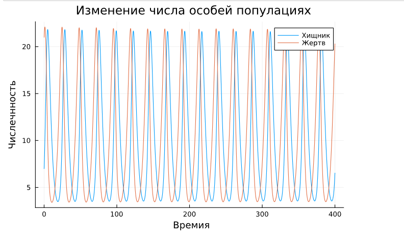

---
## Front matter
title: "Лабораторная работа № 5"
subtitle: "Модель хищник-жертва "
author: "Нзита Диатезилуа Катенди"

# Цель работы

Иследовать модель взаимодействия двух видов типа  <<хищник - жертва>> -
Модель Лотки - Вольтерры и построить графики, используя изыки julia.

# Задание
Для модели «хищник-жертва»:

$$\begin{cases}
\dfrac{dx}{dt} = - 0.28x(t) + 0.028x(t)y(t)
\dfrac{dy}{dt} =  0.29x(t) - 0.029x(t)y(t)

Постройте график зависимости численности хищников от численности жертв,
а также графики изменения численности хищников и численности жертв при
следующих начальных условиях: $x0 = 7 , $y0 = 21. Найдите стационарное
состояние системы.

# Теоретическое введение

$Моде́ль Ло́тки — Вольте́рры$ — модель взаимодействия двух видов типа «хищник — жертва», названная в честь своих авторов (Лотка, 1925; Вольтерра 1926), которые предложили модельные уравнения независимо друг от друга.[1]

Простейшая модель взаимодействия двух видов типа «хищник — жертва» -
модель Лотки-Вольтерры. Данная двувидовая модель основывается на
следующих предположениях:
1. Численность популяции жертв x и хищников y зависят только от времени
(модель не учитывает пространственное распределение популяции на
занимаемой территории)
2. В отсутствии взаимодействия численность видов изменяется по модели
Мальтуса, при этом число жертв увеличивается, а число хищников падает
3. Естественная смертность жертвы и естественная рождаемость хищника
считаются несущественными
4. Эффект насыщения численности обеих популяций не учитывается
5. Скорость роста численности жертв уменьшается пропорционально
численности хищников

$$\begin{cases}
\dfrac{dx}{dt} = -a x(t) + b x(t)y(t)\\
\dfrac{dy}{dt} = c y(t) - d x(t)y(t)
\end{cases}$$ 

В этой модели $x$ – число жертв, $y$ - число хищников. Коэффициент $a$
описывает скорость естественного прироста числа жертв в отсутствие хищников, $с$ - естественное вымирание хищников, лишенных пищи в виде жертв. Вероятность
взаимодействия жертвы и хищника считается пропорциональной как количеству
жертв, так и числу самих хищников ($xy$). Каждый акт взаимодействия уменьшает
популяцию жертв, но способствует увеличению популяции хищников (члены $-bxy$
и $dxy$ в правой части уравнения). 
Стационарное состояние системы (положение равновесия, не зависящее
от времени решение) будет в точке:
$x0=c/d$ $y0=a/b$.

# Выполнение лабораторной работы

### Создание проекта (код на Julia)

using DifferentialEquations, Plots

function run_lotka_volterra()
    a = 0.28;
    b = 0.028;
    c = 0.29;
    d = 0.029;
    t = (0, 400);
    
    function syst!(dx, x, p, t)
        dx[1] = -a*x[1] + b .* x[1] * x[2];
        dx[2] = c * x[2] - d .* x[1] * x[2];
        
    end;
    
    #при следующих начальных условиях:
    
    x0 = [7, 21];
    
    prob = ODEProblem(syst!, x0, t);
    y = solve(prob, Tsit5(), saveat = 0.01);
    u1 = Vector{Float64}()
    u2 = Vector{Float64}()
    
    t1 = collect(0:0.01:400)
    
    
    for i in range(1, length(y.t))
            push!(u1, y.u[i][1]);
            push!(u2, y.u[i][2]);
    end;
    
    plot(u1, u2, label = "Модель Лотки-Вольтерра")
end

run_lotka_volterra()    

# Второй случай

function run_lotka_volterra()
    a = 0.28;
    b = 0.028;
    c = 0.29;
    d = 0.029;
    t = (0, 400);
    
    function syst!(dx, x, p, t)
        dx[1] = -a*x[1] + b .* x[1] * x[2];
        dx[2] = c * x[2] - d .* x[1] * x[2];
        
    end;
    
    #при следующих начальных условиях:
    
    x0 = [7, 21];
    
    prob = ODEProblem(syst!, x0, t);
    y = solve(prob, Tsit5(), saveat = 0.01);
    
    
    u1 = [sol[1] for sol in y.u]
    u2 = [sol[2] for sol in y.u]
    
    t1 = collect(0:0.01:400)
    
    plot(t1, [u1, u2], label = ["Хищник" "Жертв"], title = "  Изменение числа особей популациях")
     xlabel!(" Времия")
    ylabel!("Числечнность")
end

run_lotka_volterra()    

В результаты мы получили следующие графики

{#fig:002 width=70%}

{#fig:002 width=70%}

# Вывод

В процесс выпольнения данной лабораторной работы я построил графики, используя julia,
а также приобоел первый практические навыки работы с julia

# Список литературы
[Модель хищник-жертва ](https://esystem.rudn.ru/mod/resource/view.php?id=1100264)
[2] Модель Лотки-Вольтерры: https://ru.wikipedia.org/wiki/Модель_Лотки_—_Вольтерры
